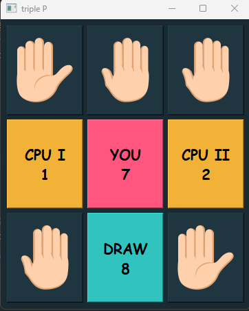

# PyLearn Assignments
## train some course and solved assignments By AmirHossein Dehmovlaei

---
| File                                           | Description                                                                                                                |
|------------------------------------------------|----------------------------------------------------------------------------------------------------------------------------|
| Palam Polum Pilish                             | In this game, which is played with more than 3 people, the players choose the winner by showing the position of their hand |
|  | Play non-stop as long as the app is open and check scores instantly                                                        |
| marriage                                       | Random marriage between girls and boys, following the law of monogamy                                                      |
| symmetric array                                | Determines whether an array of numbers is symmetric or not                                                                 |
| database                                       | Designing a very simple database                                                                                           |
