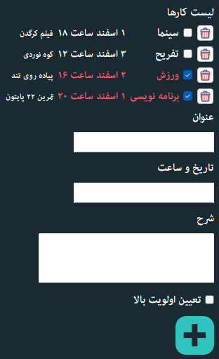

# PyLearn Assignments
## train some course and solved assignments

---
| File                              | Description                                                                                                                                    |
|-----------------------------------|------------------------------------------------------------------------------------------------------------------------------------------------|
| to do list                        | very simple to do list with pyside6 and SQLite                                                                                                 |
|  | You can run the desired program both through the  execution of the attached codes and through the  executable file in the dist folder. |
