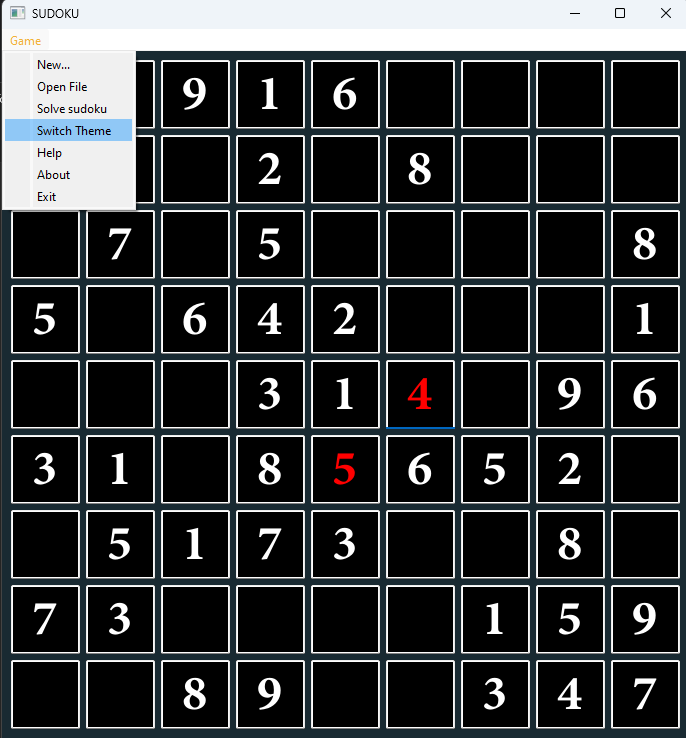
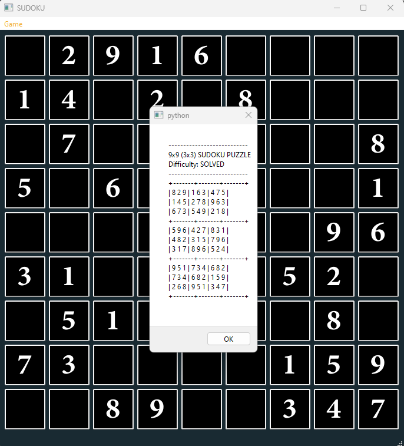

c# PyLearn Assignments
## train some course and solved assignments By AmirHossein Dehmovlaei

---
| File                                  | Description                       |
|---------------------------------------|-----------------------------------|
| SUDOKU                                | standard sudoku game...!          |
|        | Confirm the correct solution      |
|   | you can switch theme as you like  |
|  | if you confused use solved sample |
