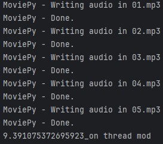
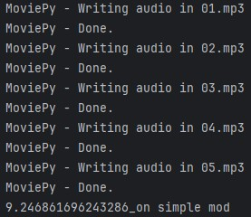

c# PyLearn Assignments
## train some course and solved assignments By AmirHossein Dehmovlaei

---
| File                                  | Description                                                                |
|---------------------------------------|----------------------------------------------------------------------------|
| downloader                            | this code download injected link by threading                              |
|      | This is an example of the downloaded files                                 |
| converter                             | this code convert mp4 formats to mp3 by moviepy whit and without threading |
|  | timing with threads                                                        |
|  | timing without threads                                                     |
