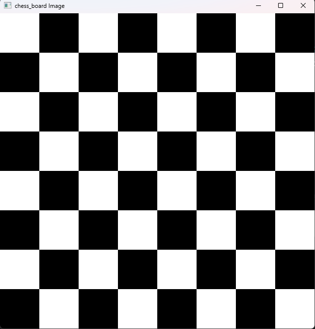
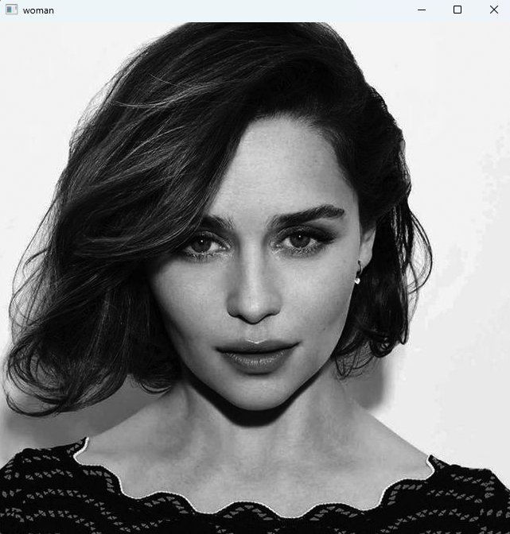
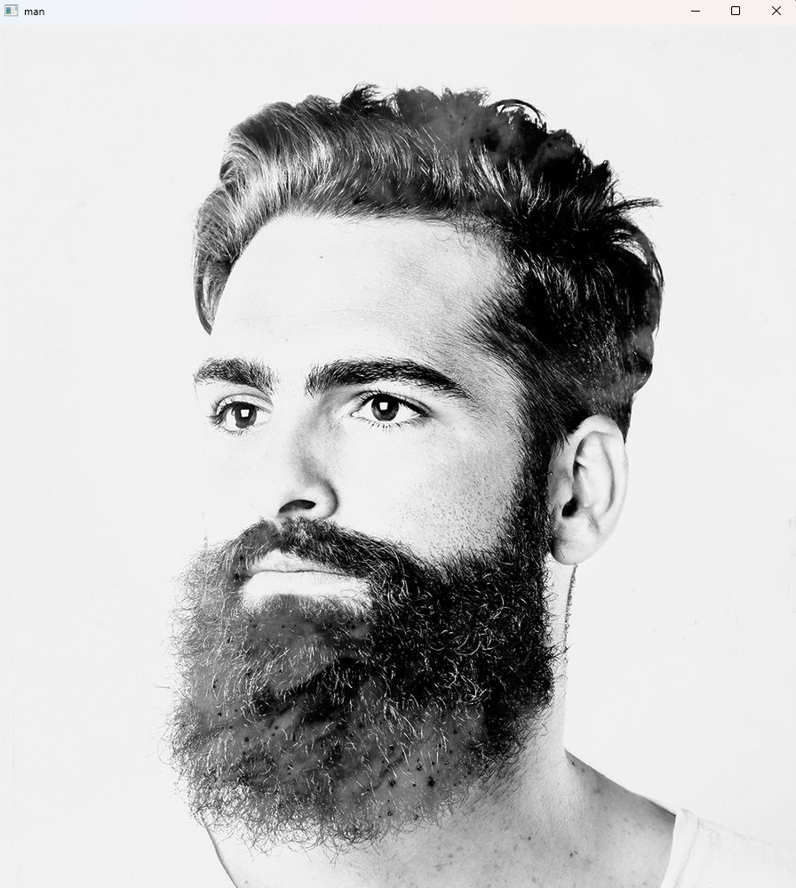
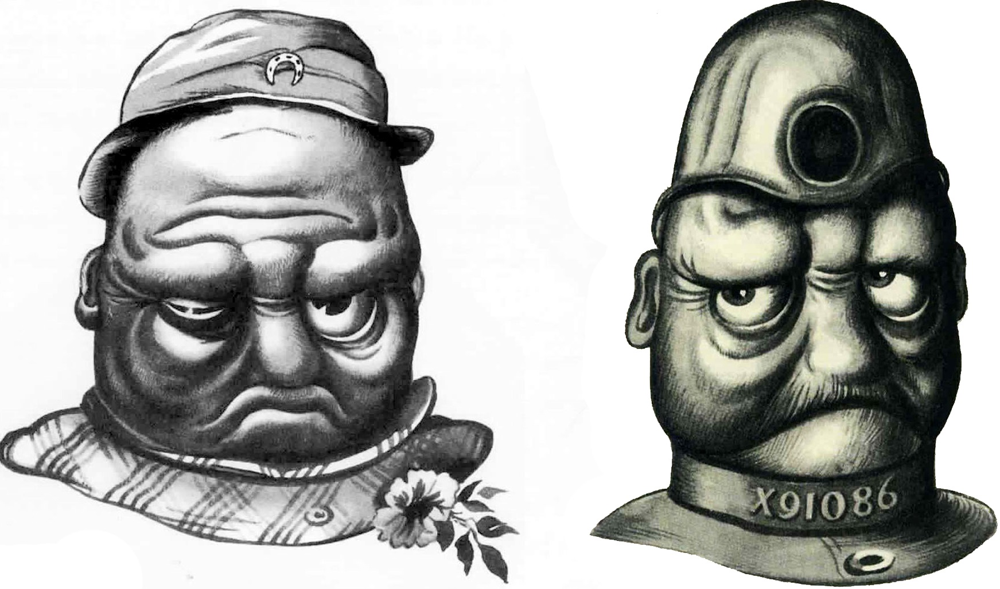
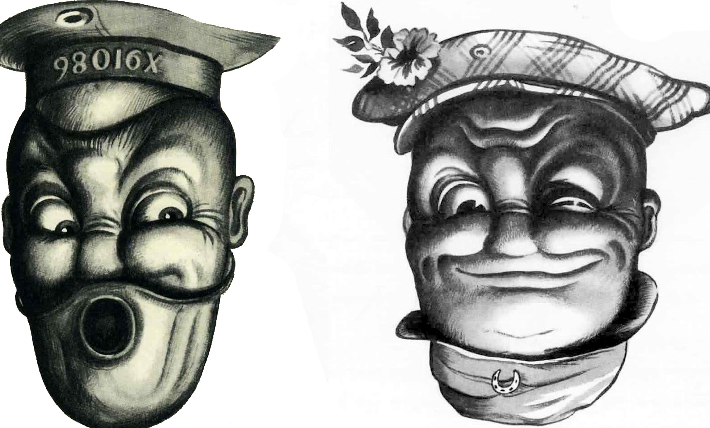
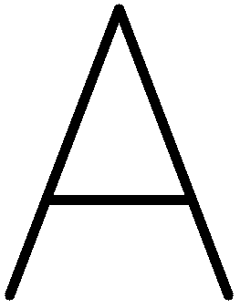
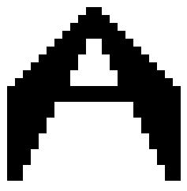
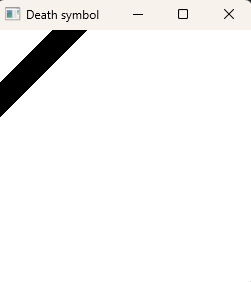

c# PyLearn Assignments
## train some course and solved assignments By AmirHossein Dehmovlaei

---
| File                                        | Description                                    |
|---------------------------------------------|------------------------------------------------|
 opencv                                      | some simple ability of cv2                     |
|  | Design Chess board                             |
| Original                                    | Inverted                                       |
|                   |  |
|                   |    |
| Original                                    | Rotated                                        |
|                   |            |
| By cv2.putText                              | My design                                      |
|   |     |
|          | Generate a gradient                            |
|          | Design death symbol                            |