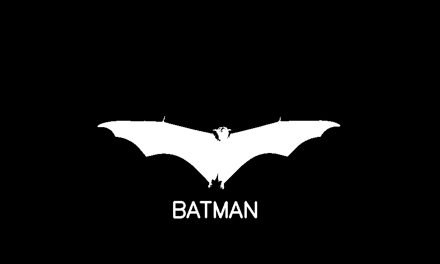
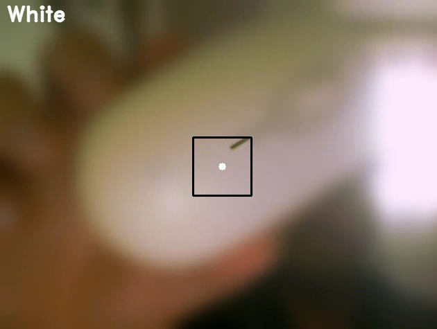

c# PyLearn Assignments
## train some course and solved assignments By AmirHossein Dehmovlaei

---
| File                         | Description                       |
|------------------------------|-----------------------------------|
| opencv                       | some simple functionality of cv2  |
| Original                     | Inverted                          |
|  |    |
| TV Noise                     |  |
| Landscape Snowfll            |  |
| Color detect with WEBCAM     |    |